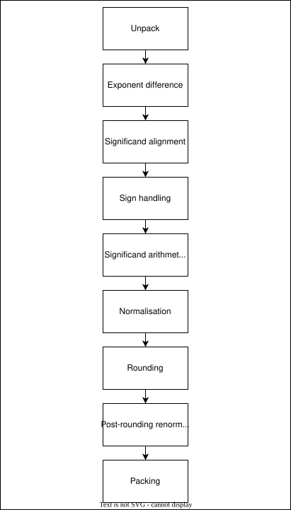
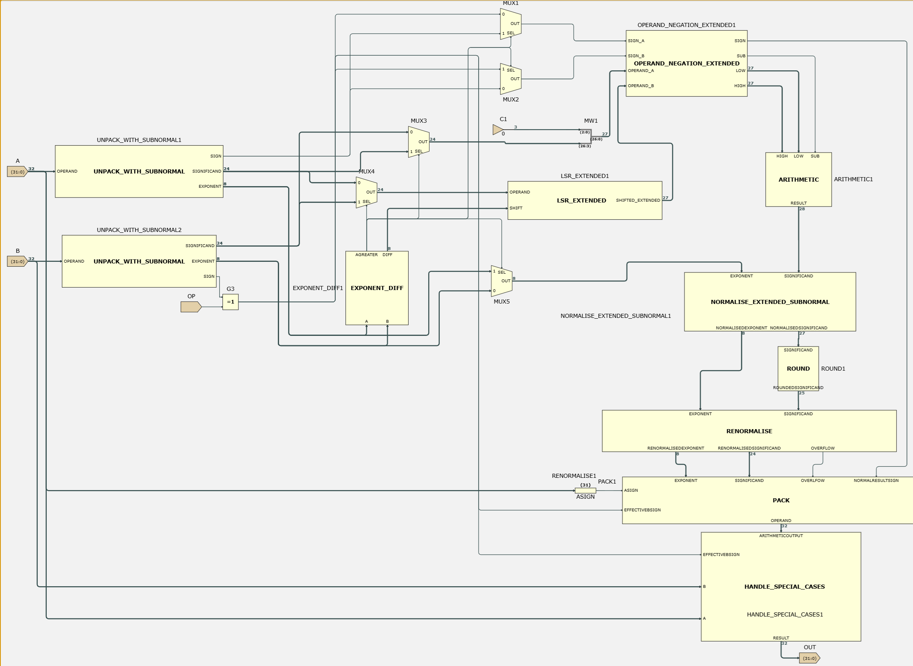
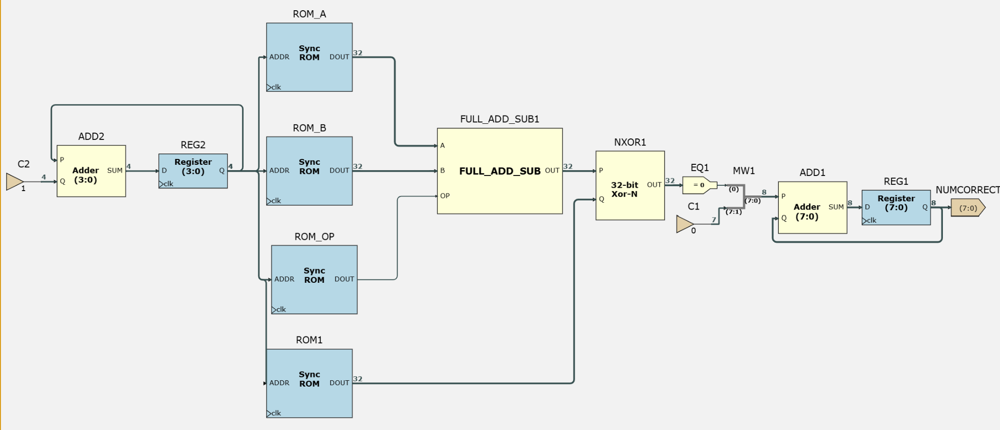
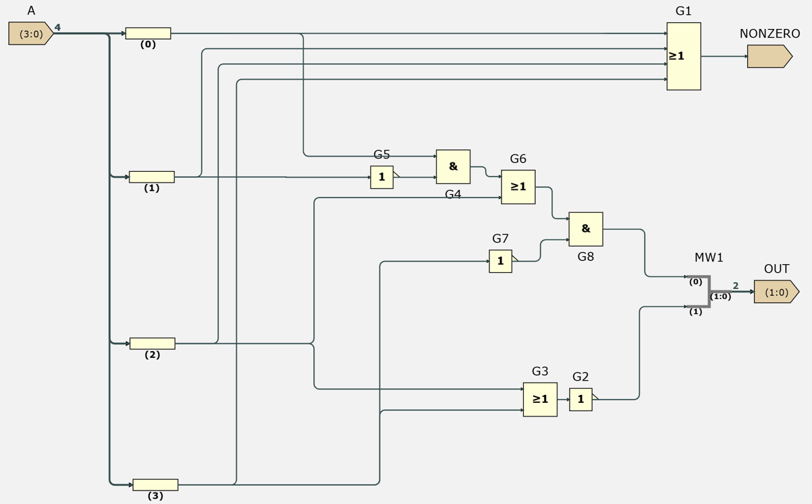
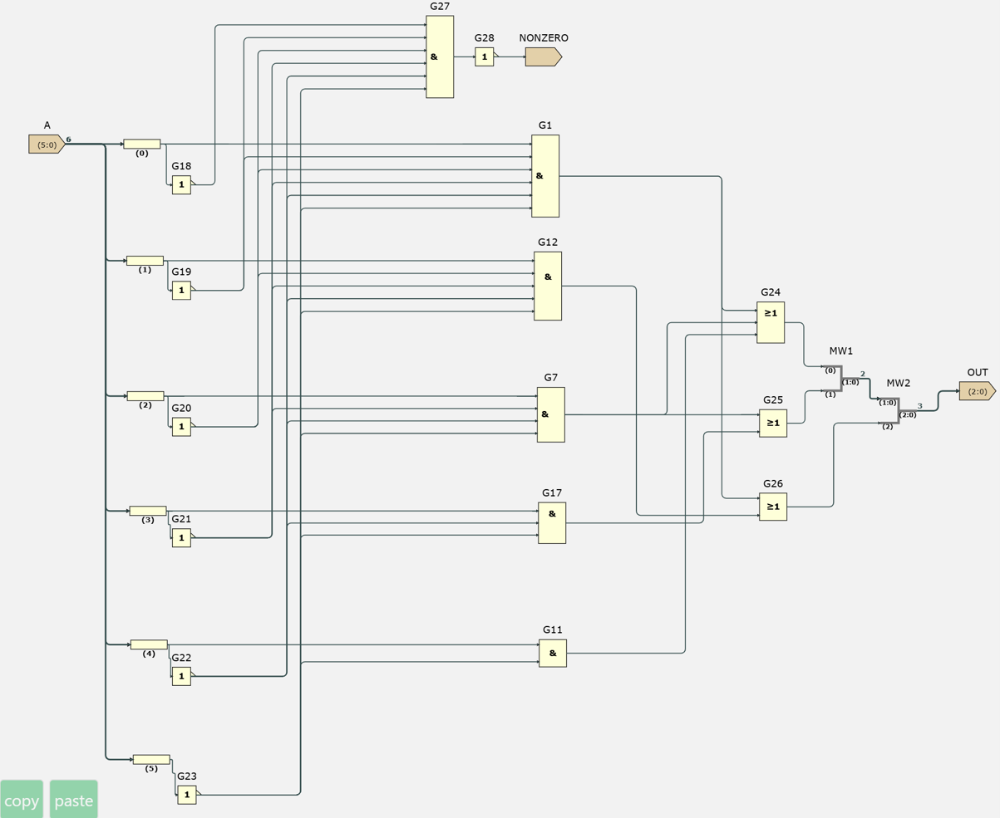
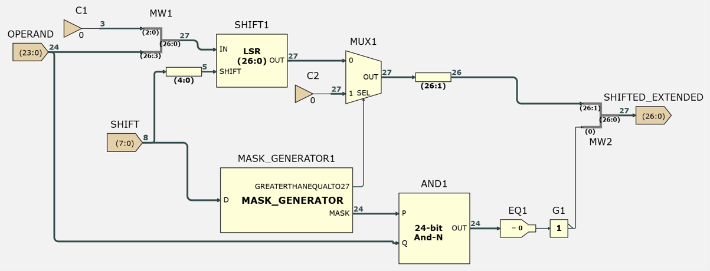
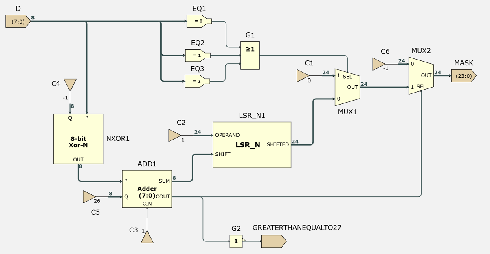
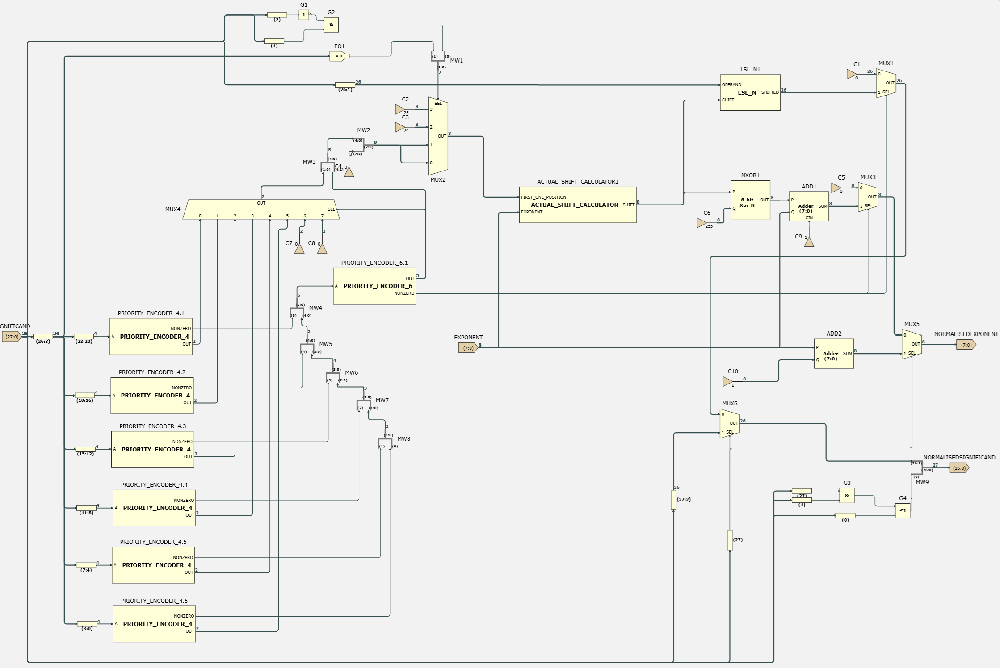
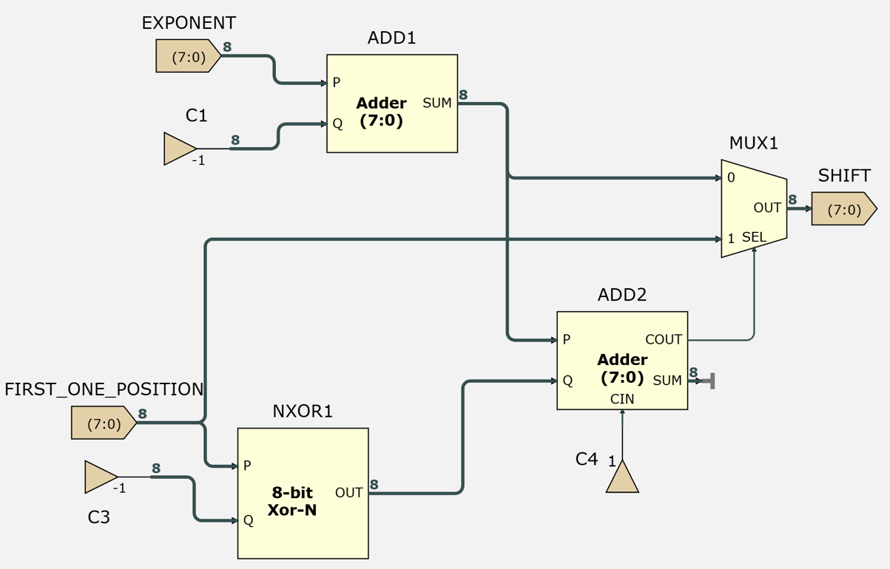

# IEEE754-Single-Precision-FPU

## Overview

This project implements a **32-bit IEEE-754 floating-point addition/subtraction datapath** with support for:

- round-to-nearest, ties-to-even;
- NaN handling;
- positive and negative infinity;
- signed zero;
- subnormal numbers.

The project was developed in two stages. I first implemented the datapath schematically to refresh and strengthen my digital-design understanding at the block and signal level. I then ported the combinational datapath to **SystemVerilog**, using the port as an opportunity to move from explicit schematic structures towards more idiomatic synthesizable RTL.

A further aim of the project is to compare the synthesised characteristics of the schematic and RTL implementations, including resource use and maximum operating frequency.

---

## Datapath Architecture

The design was decomposed into a sequence of functional stages:

<p align="center">
  
</p>

Development was incremental. I first focused on obtaining correct basic floating-point addition and subtraction, then added rounding and IEEE-754 special-case handling.

The internal datapath separates the stored IEEE-754 fields from the representation used during arithmetic. In particular, the significands are extended to preserve the **guard, round and sticky (GRS) bits** required for correct rounding.

---

## Schematic Implementation

The first implementation was constructed schematically. This made the intermediate operations explicit and forced each part of floating-point addition/subtraction to be considered as hardware rather than as a software arithmetic expression.

The schematic was organised around the same functional stages shown above. Significant blocks included:

- exponent comparison and alignment;
- extended right shifting with sticky-bit generation;
- operand ordering and effective subtraction;
- leading-one detection for normalisation;
- round-to-nearest-even logic;
- post-round renormalisation;
- IEEE-754 special-case classification and output selection.

The complete top-level schematic is shown below. More detailed block-level schematic images are stored in the [`schematics/`](schematics/) directory.

<p align="center">
  
</p>

### Schematic Verification

The schematic design was verified using directed test cases before the SystemVerilog port was developed.

<p align="center">
  
</p>

### Pipelining Approach

The schematic implementation was also used to explore timing-driven pipelining. The intention was to place pipeline boundaries based on the combinational structure and critical paths rather than simply splitting the design into an arbitrary number of equal stages.

> **TODO:** Add timing-analysis / netlist images showing the chosen pipeline boundaries and critical-path improvements.

The final synthesis comparison is discussed later in this README.

---

## SystemVerilog Port

The SystemVerilog implementation was **not intended to be a mechanical gate-for-gate translation** of the schematic.

Instead, I used the port to identify structures that could be expressed at a more appropriate RTL abstraction level while preserving the same datapath behaviour. This included blocks such as:

- `lsr_extended`;
- `normalise_extended_subnormal`;
- `renormalise`;
- `operand_negation_extended`;
- exponent comparison;
- mux networks and arithmetic blocks.

This allowed the RTL to describe the intended hardware behaviour more directly and leave lower-level implementation choices to synthesis.

### Example 1 — Leading-One Detection

The schematic normalisation logic used an explicit priority-encoder hierarchy to identify the position of the first `1` in the significand.

<p align="center">
  
</p>

<p align="center">
  
</p>

In RTL, the required behaviour can instead be expressed directly as a priority chain:

```systemverilog
module find_first_one_position(
    input  logic [23:0] significand,
    output logic [7:0]  first_one_position
);

    always_comb begin
        if      (significand[23]) first_one_position = 8'd0;
        else if (significand[22]) first_one_position = 8'd1;
        else if (significand[21]) first_one_position = 8'd2;
        else if (significand[20]) first_one_position = 8'd3;
        else if (significand[19]) first_one_position = 8'd4;
        else if (significand[18]) first_one_position = 8'd5;
        else if (significand[17]) first_one_position = 8'd6;
        else if (significand[16]) first_one_position = 8'd7;
        else if (significand[15]) first_one_position = 8'd8;
        else if (significand[14]) first_one_position = 8'd9;
        else if (significand[13]) first_one_position = 8'd10;
        else if (significand[12]) first_one_position = 8'd11;
        else if (significand[11]) first_one_position = 8'd12;
        else if (significand[10]) first_one_position = 8'd13;
        else if (significand[9])  first_one_position = 8'd14;
        else if (significand[8])  first_one_position = 8'd15;
        else if (significand[7])  first_one_position = 8'd16;
        else if (significand[6])  first_one_position = 8'd17;
        else if (significand[5])  first_one_position = 8'd18;
        else if (significand[4])  first_one_position = 8'd19;
        else if (significand[3])  first_one_position = 8'd20;
        else if (significand[2])  first_one_position = 8'd21;
        else if (significand[1])  first_one_position = 8'd22;
        else if (significand[0])  first_one_position = 8'd23;
        else                      first_one_position = 8'd24;
    end

endmodule
```

The RTL describes the required priority behaviour directly rather than reproducing the exact hierarchy of schematic encoder components.

### Example 2 — Alignment and Sticky-Bit Generation

Floating-point addition requires the smaller significand to be right-shifted until the operand exponents are aligned. Bits discarded during this shift cannot simply be ignored because they contribute to the sticky bit used during rounding.

The schematic implementation used separate shifting and mask-generation logic:

<p align="center">
  
</p>

<p align="center">
  
</p>

The RTL version combines these operations:

```systemverilog
module lsr_extended(
    input  logic [23:0] significand,
    input  logic [7:0]  shift,
    output logic [26:0] shifted_extended
);

    logic [26:0] shifted;
    logic [23:0] mask;

    always_comb begin
        if (shift < 8'd27) begin
            shifted = {significand, 3'b000} >> shift;
            shifted_extended[26:1] = shifted[26:1];
        end
        else begin
            shifted = 27'd0;
            shifted_extended[26:1] = 26'd0;
        end

        if (shift <= 8'd2) begin
            mask = 24'd0;
        end
        else if (shift >= 8'd26) begin
            mask = 24'hFFFFFF;
        end
        else begin
            mask = (24'd1 << (shift - 8'd2)) - 24'd1;
        end

        shifted_extended[0] = |(significand & mask);
    end

endmodule
```

The reduction-OR of the masked discarded bits generates the sticky bit while the shifted result retains the bits required for subsequent guard/round handling.

### Example 3 — Normalisation

The schematic normalisation stage combined leading-one detection with logic that limited the left shift so that the exponent could not be decremented below the subnormal boundary.

<p align="center">
  
</p>

The shift amount was bounded separately using the current exponent:

<p align="center">
  
</p>

In the RTL port, these behaviours are represented directly using a leading-one position, a calculated maximum legal shift, and combinational selection logic rather than reproducing the original schematic hierarchy exactly.

### Other RTL Transformations

Other parts of the port followed the same approach:

| Function | Schematic-style implementation | RTL representation |
|---|---|---|
| Exponent / magnitude comparison | Explicit arithmetic and selection logic | Direct comparison and subtraction |
| Effective subtraction | Adder/XOR-style arithmetic structure | Arithmetic expressed directly in RTL where appropriate |
| Selection networks | Explicit mux blocks | `if`, ternary expressions and `case` statements |
| Leading-one detection | Priority-encoder hierarchy | Priority `if`/`else if` chain |
| Sticky-bit generation | Separate mask-generation structure | Mask expression plus reduction OR |
| Post-round carry | Explicit arithmetic / mux handling | Widened addition followed by renormalisation |

These changes are intended to express the required behaviour more clearly at RTL level. Any claims about differences in area or timing are left to the synthesis results rather than inferred from source-code appearance alone.

---

## RTL Verification

The combinational RTL design is verified using a **self-checking SystemVerilog testbench**.

Each directed test is represented using a packed test-vector structure containing:

- operand `a`;
- operand `b`;
- add/subtract control `op`;
- expected 32-bit IEEE-754 result.

For each vector, the testbench applies the inputs, allows the combinational design to settle, compares the DUT output against the expected bit pattern, and reports any mismatch with the input operands, expected output and actual output.

The current directed suite contains **40 tests, all of which pass**.

### Directed Test Coverage

| Test(s) | Category | Purpose |
|---:|---|---|
| 0–1 | Basic addition | Establish correct normal addition |
| 2–4 | Basic subtraction | Check subtraction and result-sign selection |
| 5–6 | Negative operands | Check arithmetic involving negative values |
| 7–8 | Cancellation / zero | Check exact cancellation and zero outputs |
| 9 | Exponent alignment | Check alignment of operands with different exponents |
| 10–11 | Basic rounding | Check representable increments and ties-to-even behaviour |
| 12–19 | Infinities | Check finite/infinite combinations and invalid infinity arithmetic |
| 20–25 | Signed zero | Check IEEE-754 signed-zero combinations and cancellation |
| 26–27 | Large exponent differences | Exercise alignment when the smaller operand is shifted substantially |
| 28–30 | Rounding edge cases | Exercise sticky-driven rounding, ties-to-even and post-round carry |
| 31–34 | Subnormals | Check subnormal arithmetic and the normal/subnormal boundary |
| 35–36 | NaN handling | Check NaN special-case output handling |
| 37–39 | Overflow | Check results that overflow to positive or negative infinity |

> **TODO:** Add a terminal / simulator screenshot showing all 40 RTL tests passing.

The directed tests are grouped by datapath function so that a failure gives useful information about which part of the implementation is likely to be responsible.

---

## Pipelining and Timing Optimisation

After completing the combinational RTL implementation, I used timing measurements from Quartus to choose pipeline boundaries rather than placing registers arbitrarily.

### Block-Level Timing Characterisation

The major combinational blocks were first synthesised individually between input and output registers. This gave an approximate critical-path delay for each functional region of the datapath:

| Component | Critical path (ns) |
|---|---:|
| `unpack` | 1.664 |
| `exponent_diff` | 3.373 |
| `lsr_extended` | 7.832 |
| `operand_negation_extended` | 7.677 |
| `significand_arithmetic` | 3.941 |
| `normalise_extended_subnormal` | 10.205 |
| `round` | 3.572 |
| `renormalise` | 2.619 |
| `pack` | 3.009 |
| `handle_special_cases` | 3.600 |

Subcomponents already contained within these blocks were omitted to avoid double-counting their delay.

These measurements are only an approximation of the behaviour of the complete design. When the blocks are synthesised together, Quartus can optimise across module boundaries and routing delays can also change. The measurements were therefore used to choose an initial pipeline structure, with the final design evaluated using post-fit timing.

### Pipeline Partition Search

I wrote a small Python script to search possible pipeline boundaries automatically.

For a datapath containing \(m\) ordered functional blocks and a pipeline containing \(n\) stages, the script enumerates every possible set of \(n-1\) register boundaries. For each candidate partition, the estimated delay of each stage is calculated by summing the measured delays of its constituent blocks.

The objective is to minimise the estimated delay of the slowest stage:

$$
T_{\text{crit}} = \max(T_1,T_2,\ldots,T_n)
$$

and hence maximise the estimated operating frequency:

$$
F_{\max} \approx \frac{1}{T_{\text{crit}}}
$$

Since there were only nine possible cut locations, exhaustive search was sufficiently small and avoided the need for a more complicated optimisation algorithm.

### Initial Throughput/Latency Heuristic

I initially considered selecting the pipeline depth using a single heuristic score:

$$
S = \frac{F_{\max}}{L}
$$

where $L$ is the total pipeline latency.

This appeared to capture the trade-off that deeper pipelines can increase throughput while also increasing the number of cycles required for one operation. However, considering an ideal pipeline shows why this is not a suitable general optimisation criterion.

Assume an unpipelined combinational path has delay $k$, and that it can be divided perfectly across $n$ pipeline stages. The delay of each stage would then be:

$$
T_{\text{stage}} = \frac{k}{n}
$$

giving:

$$
F_{\max} = \frac{1}{T_{\text{stage}}}
          = \frac{n}{k}
$$

The total latency of an $n$-stage pipeline would be:

$$
L = nT_{\text{stage}}
  = n\frac{k}{n}
  = k
$$

Therefore the proposed score becomes:

$$
S = \frac{F_{\max}}{L} = \frac{n/k}{k} = \frac{n}{k^2}
$$

For an ideal pipeline, this increases linearly with the number of stages. It would therefore always favour adding more stages and does not produce a meaningful optimum.

A finite optimum only appeared with the measured data because the real system is non-ideal. Functional blocks cannot always be divided further, pipeline stages are not perfectly balanced, and additional registers introduce setup, clock-to-Q and routing overheads. These non-idealities eventually cause the improvement in $F_{\max}$ to flatten while latency and register count continue to increase.

I therefore used **diminishing returns in predicted Fmax**, rather than the throughput/latency score, as the main criterion for selecting the initial pipeline depth.

### Predicted Pipeline Behaviour

The exhaustive partition search produced the following results:

| Pipeline stages | Estimated worst-stage delay (ns) | Estimated Fmax (MHz) | Estimated latency (ns) |
|---:|---:|---:|---:|
| 1 | 47.492 | 21.06 | 47.49 |
| 2 | 24.487 | 40.84 | 48.97 |
| 3 | 20.546 | 48.67 | 61.64 |
| 4 | 12.869 | 77.71 | 51.48 |
| 5 | 12.800 | 78.13 | 64.00 |

The predicted improvement from four to five stages is only approximately **0.5%**, despite requiring another pipeline stage. This indicated that the design had reached a natural limit under the chosen functional decomposition.

The predicted four-stage partition was:

| Stage | Functional blocks | Estimated delay (ns) |
|---:|---|---:|
| 1 | `unpack` → `exponent_diff` → `lsr_extended` | 12.869 |
| 2 | `operand_negation_extended` → `significand_arithmetic` | 11.618 |
| 3 | `normalise_extended_subnormal` | 10.205 |
| 4 | `round` → `renormalise` → `pack` → `handle_special_cases` | 12.800 |

This partition is both relatively well balanced and aligned with natural functional boundaries in the datapath. It was therefore selected as the initial RTL pipeline architecture.

The resulting pipelined RTL was then re-synthesised and analysed using Quartus post-fit timing. These measured results, rather than the additive block-delay model, are used for the final performance comparison.


## Synthesis Comparison

One of the aims of the project is to compare the hardware produced from the schematic and RTL implementations rather than assuming that a more concise RTL description necessarily produces a better result.

The intended comparison includes:

| Implementation | Characterised Fmax (MHz) | Logic resources (LEs) | Notes |
|---|---:|---:|---|
| Initial combinational schematic | 24.449 | 857 | Baseline schematic |
| Pipelined / timing-optimised schematic | 59.880 | 769 | Timing-driven pipeline |
| Combinational RTL | 26.527 | 779 | Idiomatic RTL port |
| Functionally pipelined RTL | 92.507 | 951 | RTL pipeline |

Note: For combinational designs, Fmax was measured by placing the datapath between input and output registers solely for timing characterization.

> **TODO:** Add final synthesis / timing comparison figure once the implementations have been synthesised under comparable conditions.

---

## Lessons Learned

Building the schematic implementation first forced me to understand the floating-point datapath at a lower level, including exponent alignment, effective subtraction, normalisation and the propagation of information required for rounding.

Porting the same behaviour to SystemVerilog highlighted a different design skill: choosing the correct level of abstraction. RTL does not need to reproduce every mux, encoder or arithmetic component from a schematic. Instead, the required behaviour can be expressed directly and the synthesis tool can determine the lower-level implementation.

The main sources of subtle implementation bugs were:

- signal-width mismatches;
- preserving the correct intermediate width during arithmetic;
- handling guard, round and sticky information correctly;
- distinguishing stored IEEE-754 fields from the internal representation used by the datapath;
- choosing between explicit structural logic and clearer behavioural RTL.

---

## Repository Structure

```text
.
├── README.md
├── <SystemVerilog source / testbench files>
└── schematics/
    ├── actual_shift_calculator.png
    ├── full_datapath_schematic.png
    ├── lsr_extended.png
    ├── mask_generator.png
    ├── normalisation_extended_subnormal.png
    ├── priority_encoder_4.png
    ├── priority_encoder_6.png
    ├── schematic_verification_setup.png
    ├── system_decomposition_diagram.png
    └── system_decomposition_diagram.svg
```

---

## Current Status

- [x] Combinational schematic floating-point add/sub datapath
- [x] SystemVerilog port of the combinational datapath
- [x] Round-to-nearest, ties-to-even
- [x] NaN and infinity handling
- [x] Signed-zero handling
- [x] Subnormal handling
- [x] Self-checking RTL testbench
- [x] 40 directed RTL tests passing
- [ ] Add RTL verification screenshot
- [ ] Add pipelining / timing-analysis images
- [ ] Complete synthesis comparison
- [ ] Document final pipelining and timing results
